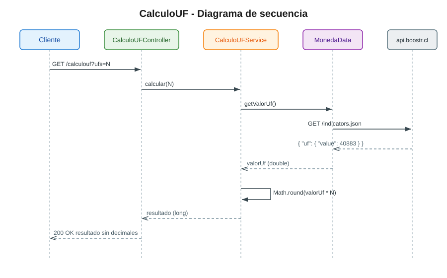

# CalculoUF

Microservicio en **Spring Boot 3** con **Java 21** que consume el endpoint de
indicadores economicos de [boostr.cl](https://api.boostr.cl/economy/indicators.json),
obtiene el valor actual de la **UF** y lo multiplica por una cantidad de UF
entregada por el cliente, devolviendo el resultado **sin decimales**.

## Arquitectura de tres capas

El proyecto sigue una arquitectura en tres capas con una responsabilidad clara
para cada una:

| Capa | Clase | Responsabilidad |
|------|-------|-----------------|
| Controller | `CalculoUFController` | Expone el endpoint HTTP y recibe la cantidad de UF. |
| Service | `CalculoUFService` | Logica de negocio: multiplica el valor de la UF por la cantidad. |
| Data | `MonedaData` | Consume el endpoint externo y obtiene el valor de la UF. |
| Entities | `ApiResponseIndicadores`, `Indicador` | Modelan la respuesta del endpoint externo. |

```
controllers/  -> CalculoUFController.java
services/     -> CalculoUFService.java
data/         -> MonedaData.java
entities/     -> ApiResponseIndicadores.java, Indicador.java
```

## Diagrama de secuencia



El flujo es: **Cliente -> Controller -> Service -> Data -> API** y el retorno
en sentido inverso hasta el cliente.

## Endpoint

```
GET /calculouf?ufs={entero}
```

| Parametro | Tipo | Descripcion |
|-----------|------|-------------|
| `ufs` | Integer | Cantidad de UF a calcular. |

**Respuesta:** un entero (`long`) con el valor `valorUf * ufs` redondeado sin decimales.

Ejemplo (con `value: 40883` y `ufs=3`):

```bash
curl "http://localhost:1984/calculouf?ufs=3"
# 122649
```

## Requisitos

- Docker (con el plugin Docker Compose)

> La compilacion, las pruebas y el reporte de cobertura ocurren **dentro** de la
> imagen Docker (build multi-stage), por lo que no es necesario tener Java ni
> Maven instalados en la maquina.

---

## 1. Compilacion

La compilacion ocurre dentro de la imagen (build multi-stage). Este paso tambien
corre las **pruebas unitarias** y genera el **reporte de cobertura JaCoCo**:

```bash
docker compose build
```

> Para ver la salida completa de la compilacion y de los tests (sin cache):
>
> ```bash
> docker compose build --no-cache
> ```

## 2. Ejecucion

```bash
# Construir la imagen (si hace falta) y levantar el servicio EN SEGUNDO PLANO (-d)
docker compose up --build -d
```

> IMPORTANTE: use siempre `-d` (segundo plano). Si ejecuta `docker compose up`
> sin `-d`, el contenedor queda atado a la terminal y **se detiene al cerrar la
> terminal o perder la sesion (SSH)**, produciendo el error
> `curl: (56) Recv failure: Connection reset by peer`.

El servicio queda disponible en `http://localhost:1984`.

> **ESPERE a que el servicio termine de arrancar antes de consultarlo.**
> El arranque tarda unos segundos (~10-15 s). Debe esperar a ver la linea
> `Started CalculoufApplication` en los logs antes de hacer la consulta:
>
> ```bash
> docker compose logs -f
> #  espere a ver: Started CalculoufApplication in X seconds
> #  (salir del log con Ctrl+C NO detiene el servicio)
> ```
>
> Si consulta el endpoint antes de que termine de iniciar, obtendra
> `curl: (56) Recv failure: Connection reset by peer`. No es un error:
> espere a que arranque y reintente.

Una vez arriba, se prueba con:

```bash
curl "http://localhost:1984/calculouf?ufs=3"
# Respuesta esperada: 122649
```

Para detener y eliminar el contenedor:

```bash
docker compose down
```

## 3. Ver los logs

El servicio tarda unos segundos en arrancar. Espere a ver la linea
`Started CalculoufApplication` antes de consultar el endpoint.

```bash
# Seguir los logs en vivo
docker compose logs -f
#  (salir del log con Ctrl+C NO detiene el servicio)

# Estado del contenedor (debe decir "Up ...")
docker compose ps
```

> Si consulta el endpoint antes de ver `Started CalculoufApplication`, puede
> obtener `curl: (56) Recv failure: Connection reset by peer`: espere a que
> termine de iniciar y reintente.

## 4. Pruebas unitarias

Las pruebas unitarias de las tres capas (`CalculoUFControllerTest`,
`CalculoUFServiceTest`, `MonedaDataTest`) y la de carga de contexto
(`CalculoufApplicationTests`) se ejecutan automaticamente durante la
compilacion de la imagen.

```bash
# Muestra la ejecucion de los tests en la salida del build
docker compose build --no-cache
```

Si algun test falla, el build de la imagen falla, por lo que un
`docker compose build` exitoso garantiza que todas las pruebas pasaron.

## 5. Ver el reporte de cobertura (JaCoCo)

El reporte JaCoCo se genera durante la compilacion y queda incluido en la imagen
en la ruta `/jacoco`. Para extraerlo a la maquina y abrirlo en el navegador:

```bash
# 1. Asegurarse de que la imagen este construida y el contenedor exista
docker compose up --build -d

# 2. Copiar el reporte desde el contenedor a la carpeta actual
docker cp calculouf:/jacoco ./jacoco-report

# 3. Abrir el reporte HTML
#  Linux:
xdg-open jacoco-report/index.html
#  macOS:
open jacoco-report/index.html
```

El reporte incluye los formatos:

```
jacoco-report/index.html   (HTML navegable)
jacoco-report/jacoco.xml    (formato XML, para integracion CI)
jacoco-report/jacoco.csv    (formato CSV)
```

---

## Uso con curl

La aplicacion escucha en el puerto **1984**.

```bash
# Calcular el valor de 3 UF
curl "http://localhost:1984/calculouf?ufs=3"
# -> 122649   (valorUf * 3, sin decimales)

# Calcular el valor de 1 UF
curl "http://localhost:1984/calculouf?ufs=1"
# -> 40883

# Ver los headers de la respuesta (verbose)
curl -v "http://localhost:1984/calculouf?ufs=10"
```

> El parametro `ufs` es la cantidad de UF a calcular. La respuesta es un
> entero (`long`) con el resultado `valorUf * ufs` redondeado sin decimales.

## Configuracion

En `src/main/resources/application.properties`:

```properties
spring.application.name=calculouf
server.port=1984
url.api=https://api.boostr.cl/economy/indicators.json
```

## Solucion de problemas

### Errores comunes

| Sintoma | Causa | Solucion |
|---------|-------|----------|
| `curl: (56) Recv failure: Connection reset by peer` | El servicio aun no termina de arrancar. | Espere ~10-15 s a ver `Started CalculoufApplication` en los logs y reintente. |
| `curl: (56) Recv failure: Connection reset by peer` (persistente) | El contenedor se detuvo (se lanzo sin `-d` y se cerro la terminal/sesion). | Levantelo con `docker compose up -d`. Verifique con `docker compose ps`. |
| `curl: (7) Failed to connect ... port 1984` | El servicio no esta corriendo o el puerto 1984 esta ocupado. | Ejecute `docker compose up --build -d` y confirme que no haya otro proceso usando el 1984. |
| Respuesta HTTP 500 | Version antigua de la imagen o el endpoint externo no responde. | Reconstruya con `docker compose up --build -d`. Verifique acceso a `https://api.boostr.cl`. |

### Requisito de red

El servicio consume `https://api.boostr.cl/economy/indicators.json` en cada
consulta, por lo que el entorno donde se ejecute **debe tener acceso a
internet** hacia ese dominio.
